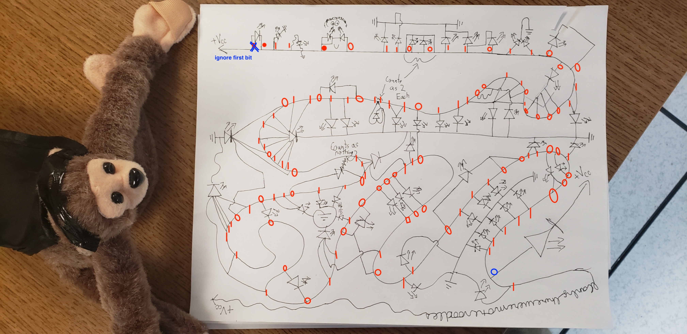

> Start from the monkey's paw and work your way down the high voltage line, for every wire that is branches off has an element that is either on or off. Ignore the first bit. Standard flag format.
> - Elyk

We follow the task and come up with this solution:

We than convert from binary to text and get the flag.

Flag: `flag{owmyhand}`
