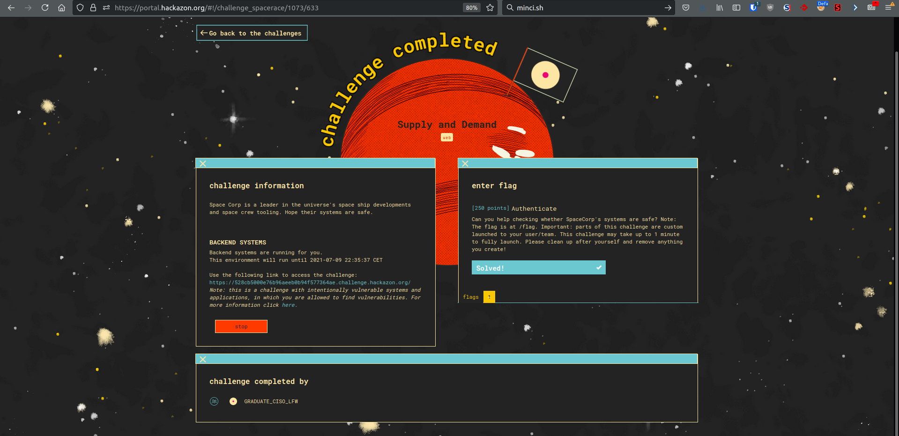

Didn't have time to do a writeup before the challenge was taken down. But basically, this was a CI/CD application which exposed websites. You could browse the source of each website and see that one of them was attempting to use a package which did not exists. Hence, you could create that package and when the website was redeployed (ie. every 5 minutes or so), it would pull your malicious package and you could gain code execution from this. 

Pretty awesome challenge, wish I could have made a writeup for it. 

I wanted to include it anyways since we managed to get first blood on that challenge! (ie. bragging rights, right?)

