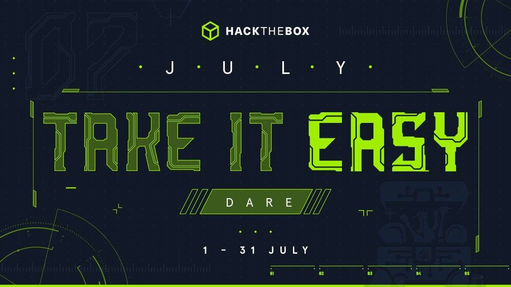
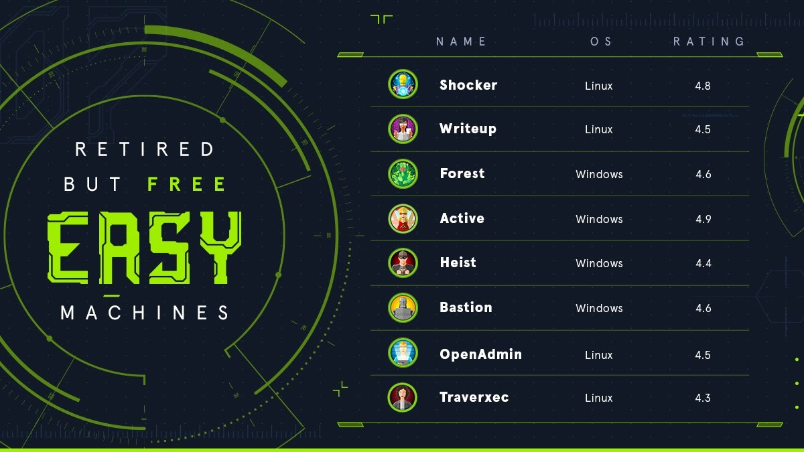
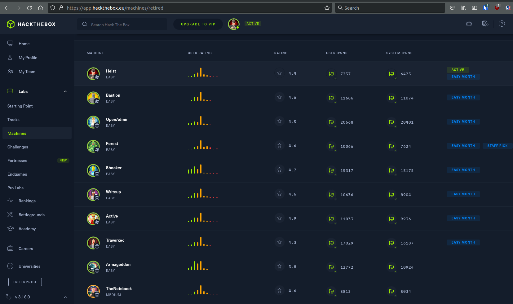

# HackTheBox - Take It Easy Dare \[Easy Month\]

This month was pretty eventful with Hacky Holidays having a 3 week long CTF and HackTheBox releasing their "Take It Easy Dare". This made for a lot of opportunities to practice and some great challenges to learn new things.

Ref: https://www.hackthebox.eu/newsroom/htb-take-it-easy-july-2021

HTB "Take It Easy Dare" was essentially a number of retired easy boxes that were made available for everyone during the month of July. There were a few Windows Active Directory boxes where you had to make use of AD attack tools such as Bloodhound which made this a good preparation for the OSEP.

The following machines were made available as part of the easy month:

I was only able to start on these boxes the last weekend of July since the other weekends were spent participating in the Hacky Holidays Space Race CTF. However, I managed to get all 8 boxes done during those 2 days:

I hadn't done any of the boxes prior to easy month so it was a great challenge to try and achieve all of them in 2 days.

I've done writeups for all of the boxes as a way to practice using Obsidian as a note taking app:

https://github.com/fyxme/writeups/tree/master/boot2root/hack-the-box

## Favorite box

My favorite box was by far "forest" which showcased an AD misconfuration and allowed me to practice AD tools and attacks in preparation for the OSEP.

"active" was another great box with required escalating privileges using AD attacks.

If you're intersted in doing those boxes, I'd recommend starting with "active" as I believe its easier to exploit than "forest".

_Note: I don't want to give too much away and spoil the boxes for those who are interested in doing them. If you've already done them or don't intend to, you can read the writeups using the links above. _

Another box worth mentioning which is currently in the active pool is "intelligence". Its another AD box and is very fun to exploit. (writeup not released since box is still active) 

## Notetaking app

I've started using [Obisidian](https://obsidian.md/) to take notes and I've started learning how to take note efficiently so that its easier to make writeups once you've finished a box. My favorite feature by far is the ability to use the [Flameshot](https://flameshot.org/) (another tool) to take a screnshot of something and simply save the screenshot to the clipboard and paste it directly into Obsidian. It saves a lot of time removes the hassle of having to move the files around. 

Its also great to be able to go back and view your writeups, tools you've used and how you've solved problems you encountered. Highly recommend you start taking even if you're simply doing the boxes for fun and games. 

This was a great way for me to test Obsidian as a note taking app and its been a blast to use from start to finish.  

## Final remarks

It was a great present from HTB to allow that many retired boxes to be made available for free users. The box choices were great and definitely got me interested in looking at purchasing a VIP subscription. (Good HTB, great marketing idea!)

Doing the boxes over 2 days was tough but really fun at the same time. I would have regretted not participating in the event.

I hope they release more events like these in the future.
