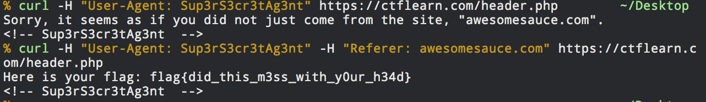

> DON'T BUMP YOUR HEAD(ER)
>
> Try to bypass my security measure on this site! http://165.227.106.113/header.php

The main page gives us a useful message : "Sorry, it seems as if your user agent is not correct, in order to access this website."

By looking at the pages code we discover a html comment as so `<!-- Sup3rS3cr3tAg3nt -->`

A curl request with the user agent set to `Sup3rS3cr3tAg3nt` (`curl -H "User-Agent: Sup3rS3cr3tAg3nt" https://ctflearn.com/header.php`)

return this:
'Sorry, it seems as if you did not just come from the site, "awesomesauce.com".'

Setting the referer to awesome.com and requesting the page again gives us the flag:
`curl -H "User-Agent: Sup3rS3cr3tAg3nt" -H "Referer: awesomesauce.com" https://ctflearn.com/header.php`

Flag: `flag{did_this_m3ss_with_y0ur_h34d}`

