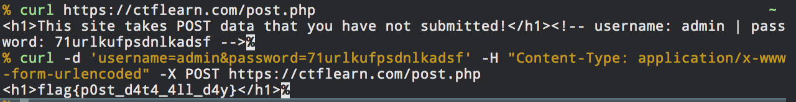

> POST PRACTICE
> These website requires authentication, via POST. However, it seems as if someone has defaced our site. Maybe these is still some way to authenticate? http://165.227.106.113/post.php

The main page tells us that the page requires a POST request alongside some data we have not submitted.

By inspecting the page's source we can see that there is a comment with a username and password.

By making a curl POST request we get the flag:
`curl -d 'username=admin&password=71urlkufpsdnlkadsf' -H "Content-Type: application/x-www-form-urlencoded" -X POST https://ctflearn.com/post.php`

Flag: `flag{p0st_d4t4_4ll_d4y}`

