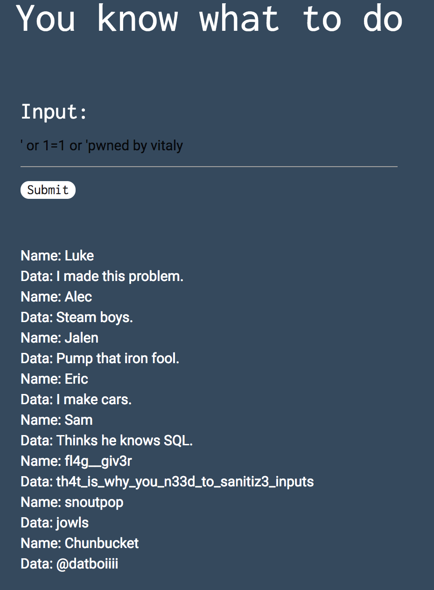

> BASIC INJECTION
>
> See if you can leak the whole database. The flag is in there somwhere… https://web.ctflearn.com/web4/

This website is vulnerable to sql injection.

We can test for it by doing:
`' or sleep(5) or '`
which causes the request to sleep for 5 seconds

A simple `' or 1=1 or '` gives us all the users including the *fl4g_giv3r* user and the associated data is the flag

Flag: `th4t_is_why_you_n33d_to_sanitiz3_inputs`

